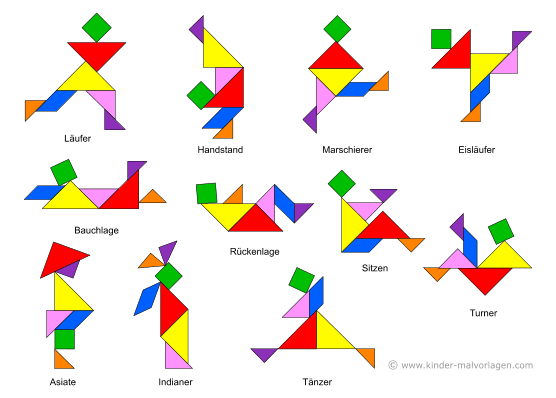

```{r setup, include = FALSE}
knitr::opts_chunk$set(echo = TRUE)
if (!requireNamespace("webex")) {
  stop("You must have the 'webex' package installed to knit HTML from this template.\n   devtools::install_github(\"psyteachr/webex\")")
} else {
  library("webex")
}
```

```{css, echo=FALSE}
.box {
        display: flex;
      }

      .box > * {
        flex: 1 1 0;
      }
```



## Aufwärmtraining des Tages

:::::: {class="box"}

::: {}

$(2s+r)(2s-r) =$ `r mcq(c("4s²+4rs-r²", "4s²-4rs+r²", "2s²-r²",  answer = "4s²-r²"))`

$(2s+r)(r-2s) =$ `r mcq(c("4s²-r²", answer = "r²-4s²", "0",  "4s²-4rs+r²"))`

:::

::: {}

$(5w-8q)² =$ `r mcq(c(answer = "25w²-80qw+64q²", "5w²-80qw+8q²", "25w²-64q²",  "10w²-80qw+16q²"))`

$(8q-5w)² =$ `r mcq(c("8q²-80qw+5w²", answer = "25w²-80qw+64q²", "64q²-25w²",  "64q²+80qw-25w²"))`

:::

::: {}

$(-7t+2k)² =$ `r mcq(c("-49t²+28kt+4k²", "-49t²-28kt+4k²", answer = "49t²-28kt+4k²",  "49t²+28kt+4k²"))`

$(-2s-3t)² =$ `r mcq(c("-4s²-12st-9t²", answer = "4s²+12st+9t²", "-4s²+12st-9st",  "4s²-12st+9t²"))`

:::
::::::


<hr>


## Flächeninhalte berechnen

:::::: {class="box"}

::: {}


### [Dreieck](https://gdischinger.github.io/Mathe_8d/03FormelnErstellen/Dreieck.html)

### [Parallelogramm](https://gdischinger.github.io/Mathe_8d/03FormelnErstellen/Parallelogramm.html)

### [Trapez](https://gdischinger.github.io/Mathe_8d/03FormelnErstellen/Trapez.html)
:::

::: {}

### [Vieleck](https://gdischinger.github.io/Mathe_8d/03FormelnErstellen/Vieleck.html)

### [Kreis](https://gdischinger.github.io/Mathe_8d/03FormelnErstellen/Kreis.html)

:::
::::::


<hr>


## Trainingsraum

:::::: {class="box"}

::: {}

### [Grundlagenausdauer](https://gdischinger.github.io/Mathe_8d/03FormelnErstellen/Grundlagenausdauer.html) 

:::

::: {}

### [Höhentraining](https://gdischinger.github.io/Mathe_8d/03FormelnErstellen/Hoehentraining.html) 

:::
::::::

