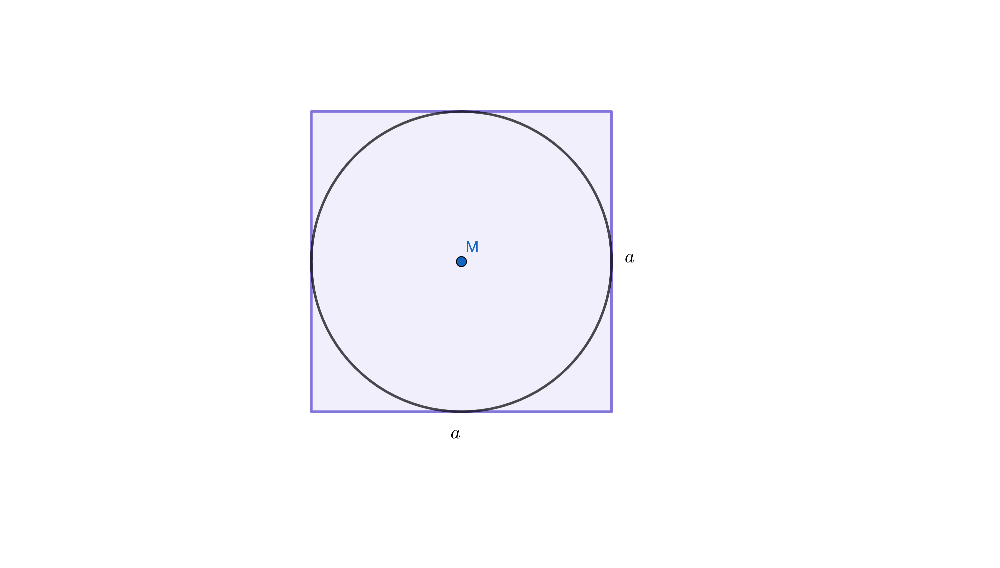
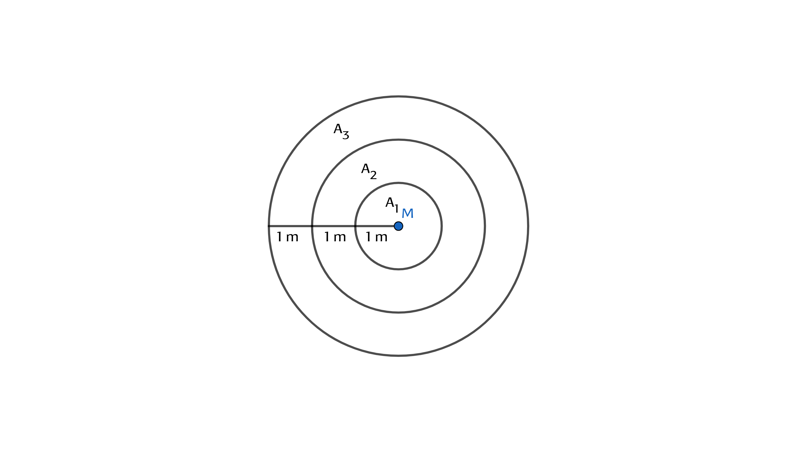

```{r setup, include = FALSE}
knitr::opts_chunk$set(echo = TRUE)
library("webex")
library("kableExtra")
```

```{css, echo=FALSE}
.box {
        display: flex;
      }

      .box > * {
        flex: 1 1 0;
      }
```

:::: {style="display: flex;"}

::: {}

<br><br><br><br>
In diesem Abschnitt dreht sich alles ~~im~~ um den Kreis!

:::

::: {}

:::

::: {}


:::

::::


## Die Vorüberlegungen zum Kreis findest Du hier:


### [Kreisumfang](https://gdischinger.github.io/Mathe_8d/03FormelnErstellen/Kreisumfang.html)


### [Kreisfläche](https://gdischinger.github.io/Mathe_8d/03FormelnErstellen/Kreisflaeche.html)


<br><br>


## Zusammenfassung der Ergebnisse

:::: {style="display: flex;"}

::: {}

Für den Durchmesser $d$ des Kreises gilt:

<br>

Für den Umfang $U$ des Kreises gilt:

<br>

<br>

Für den Flächeninhalt gilt:
:::

::: {}

:::

::: {}

$\quad d=2\cdot r$

<br>

$\quad U= d \cdot \pi$

$\quad U = 2 \cdot r \cdot \pi$

<br>

$\quad A=\pi \cdot r²$

:::

::::


<br><br>
<hr> 

## Aufgaben

<br>

### Aufgaben zum Umfang{.tabset}

#### {}

<br><br>

#### Aufgabe 1
Berechne die fehlenden Größen.
```{r, 'kable'}
```
<br> |a) |b) | c)
------|------|------|-----
Radius $r$ | $17cm$ | | 
Durchmesser $d$ | |  | $9,1 mm$
Umfang $U$ |  | $3,2m$ | 


`r hide("Lösung")`

**Die fehlenden Größen lauten:**
```{r, 'kable'}
```
<br> |a) |b) | c)
------|------|------|-----
Radius $r$ | $17cm$ |$0,509m$ |$4,55mm$
Durchmesser $d$ | $34cm$| $1,019m$  | $9,1 mm$
Umfang $U$ |$106,81cm$  | $3,2m$ | $28,59mm$


 **Rechnungen:**

:::: {class="box"}

::: {}
**a)**

**Durchmesser**

$d=2 \cdot r = 2 \cdot 17 cm = 34 cm$

<br>

**Umfang**

$U = \pi \cdot d = \pi \cdot 34 cm \approx 106,81 cm$
:::

::: {}

:::

::: {}
**b)**

**Durchmesser**

Einsetzen führt zu folgender Gleichung:

$3,2m = \pi \cdot d \quad$

<br>

Auflösen ergibt:

$$ \begin{align} 3,2m &= \pi \cdot d \quad\quad |: \pi \\
{}\\
{3,2m \over \pi} &= d \\
{}\\
\Rightarrow d & \approx 1,019 m
\end{align}$$.

<br>

**Radius**

Einsetzen führt zu folgender Gleichung:

$$1,019 m =2 \cdot r$$

<br>

Auflösen ergibt:

$$ \begin{align} 1,019 m &=2 \cdot r \quad\quad |: 2 \\
{}\\
{1,019m \over 2} &= r \\
{}\\
\Rightarrow r & \approx 0,509 m
\end{align}$$.
:::

::: {}

:::

::: {}
**c)**

**Umfang**

$U = \pi \cdot 9,1mm \approx 28,59 mm$

<br>

**Radius**

Einsetzen führt zu folgender Gleichung:

$$9,1 mm =2 \cdot r$$

<br>

Auflösen ergibt:

$$ \begin{align} 9,1 mm &=2 \cdot r \quad\quad |: 2 \\
{}\\
{9,1mm \over 2} &= r \\
{}\\
\Rightarrow r & = 4,55mm
\end{align}$$.
:::

::::


`r unhide()`

<br><br>

#### Aufgabe 2
Walter Hudson, einer der umfangreichsten Männer der Welt, hatte einen Bauchumfang von ca. $2,80 m$. Passt er durch eine $80 cm$ breite Tür?


`r hide("Lösung")`

**Vorüberlegung**

Um zu wissen, ob Walter Hudson durch die Tür passt, müsste man seinen Durchmesser kennen.


**Gegeben**

1. Walter Hudons Bauchumfang mit $2,80m = 280cm$
2. die Angabe, dass die Tür $80 cm$ breit ist.

Für den Umfang eines Kreises gilt:

$$ U = \pi \cdot d$$.


**Einsetzen**

Setzt man den gegebenen Bauchumfang ein, ergibt sich folgende Gleichung:
$$ 280 cm = \pi \cdot d $$

**Auflösen**

Diese Gleichung muss man nach $d$ auflösen:
$$\begin{align} 280 cm &= \pi \cdot d \quad\quad | : \pi\\
{}\\
{280cm \over \pi } &= d\\
{}\\
\Rightarrow \quad d &\approx 89 cm \quad > 80 cm
\end{align}$$

**Antwort**

Leider passt Walter Hudson nicht durch die Tür.

`r unhide()`

<br><br>

#### Aufgabe 3


<!--  -->

a) Der Äquator hat eine Länge von etwa 40000 km. Wie groß ist der Erdradius $r$?

b) Ein 40000 km langes Seil, das am Äquator straff um die Erde gespannt war, wird geringfügig um 1m verlängert und so gestrafft, dass der Abstand von der Erde überall gleich ist. Kannst du jetzt unter diesem Seil hindurchkriechen?


:::: {class="box"}

::: {}

`r hide("Lösung der Teilaufgabe a)")`
**Vorüberlegung**

Die Länge des Äquators entspricht dem Umfang der Erde.


**Gegeben**

Der Umfang der Erde: $40000km$

Für den Umfang eines Kreises gilt:

$$ U = \pi \cdot d$$.


**Einsetzen**

Setzt man den gegebenen Erdumfang ein, ergibt sich folgende Gleichung:
$$ 40000km = \pi \cdot d $$

**Auflösen**

Diese Gleichung muss man nach $d$ auflösen:
$$\begin{align} 40000km &= \pi \cdot d \quad\quad | : \pi\\
{}\\
{40000km \over \pi } &= d\\
{}\\
\Rightarrow \quad d &\approx 12732 km
\end{align}$$


Damit folgt für den Erdradius:

$$ r = {1 \over 2} \cdot d = {1 \over 2} \cdot 12732 km \approx 6366 km$$

`r unhide()`

:::

::: {}


`r hide("Lösung der Teilaufgabe b)")`

Für den Umfang eines Kreises gilt:

$$U = 2 \cdot \pi \cdot r $$


**Auflösen**

Auflösen dieser Gleichung nach $r$ ergibt:

$$ \begin{align} U &= 2 \cdot \pi \cdot r \quad\quad | :2 \pi \\
{}\\
{U \over 2 \cdot \pi} &= r
\end{align}$$


**Einsetzen**

Setzt man nun die gegebenen Größen ein, ergibt sich:

$$r = {4ooookm + 1m \over 2 \pi} = \underbrace{40000km \over 2\pi}_{Erdradius}+\underbrace{1m \over 2\pi}_{"Zugewinn"}$$

Zum besseren Vorstellen hier noch eine Skizze:


Das Seil steht also ${1 \over 2\pi}m \approx 0,16 cm$ von der Erde ab. 

Zumindest ich bin zu groß um darunter durch zu passen ....


`r unhide()`


:::

::::

<br><br>

#### Aufgabe 4
Die Räder eines Fahrrades haben einen Durchmesser von $71cm$. Wie viele Umdrehungen macht jedes Rad pro km?

`r hide("Tipp")`


Wenn sich das Rad einmal ganz dreht, bist du um den Radumfang weitergekommen. Wieviele Umdrehungen passen in einen Kilometer?

`r unhide()`


`r hide("Lösung")`

Bei einem Durchmesser von $71cm$ hat das Rad einen Umfang von

$$U = d \cdot \pi =  71 cm \cdot \pi \approx 223cm = 2,23m$$
In einen Kilometer ($1000m$) passen also

$${1000 m \over 2,23 m} \approx 448,43$$

Radumdrehungen.

`r unhide()`

<br><br>


### Aufgaben zum Flächeninhalt{.tabset}

#### {}

<br><br>


#### Aufgabe 1
Berechne die fehlenden Größen.
```{r, 'kable'}
```
<br> |a) |b) | c)
------|------|------|-----
Radius $r$ | | | 
Durchmesser $d$ | |  | $7,543m$
Umfang $U$ |  | $1,543km$ | 
Flächeninhalt $A$ | $13cm²$  |  |


`r hide("Lösung")`

**Die fehlenden Größen lauten:**
```{r, 'kable'}
```
<br> |a) |b) | c)
------|------|------|-----
Radius $r$ | $2,034 cm$ | $0,246 km$ | $3,772 m$
Durchmesser $d$ | $4,068 cm$ | $0,491 km$ | $7,543m$
Umfang $U$ | $12,78 cm$  | $1,543km$ | $23,70 m$
Flächeninhalt $A$ | $13cm²$  | $0,189 km²$ | $44,69 m²$


 **Rechnungen:**

:::: {class="box"}

::: {}
**a)**

**Radius**

$A = \pi \cdot r²$ nach $r$ auflösen:

$$\begin{align} A &= \pi \cdot r² \quad |:\pi \\
{}\\
{A \over \pi} &= r² \quad |\sqrt{\quad}\\
{}\\
\sqrt{A \over \pi} &= r
\end{align}$$

$A=13cm²$ einsetzen:

$$r = \sqrt{13 cm² \over \pi} \approx 2,034 cm$$

**Durchmesser**

$d=2 \cdot r \approx 2 \cdot 2,034 cm \approx 4,068 cm$

<br>

**Umfang**

$U = \pi \cdot d \approx \pi \cdot  4,068 cm \approx 12,78 cm$
:::

::: {}

:::

::: {}
**b)**

**Durchmesser**

Die Formel für den Flächeninhalt eines Kreises $U= \pi \cdot d$ beschreibt den Zusammenhang zwischen Durchmesser und Umfang des Kreises.

Auflösen ergibt:

$$ \begin{align} U &= \pi \cdot d \quad\quad |: \pi \\
{}\\
{U \over \pi} &= d 
\end{align}$$.

$U=1,543 km$ einsetzen:

$$d={1,543 km \over \pi} \approx 0,491 km$$

<br>

**Radius**

$d = 2 \cdot r$ nach $r$ auflösen:

$$\begin{align} d &=2 \cdot r \quad |:2\\
{}\\
{d \over 2} &= r
\end{align}$$

$0,491 km$ einsetzen:

$$r \approx {0,491 km \over 2} \approx 0,246 km$$

<br>

**Flächeninhalt**

$A = \pi \cdot r² \approx \pi \cdot (0,246 km)² \approx 0,189 km²$


:::

::: {}

:::

::: {}
**c)**

**Umfang**

$U = \pi \cdot d = \pi \cdot 7,543 m \approx 23,70 m$

<br>

**Radius**

$d = 2 \cdot r$ nach $r$ auflösen:

$$\begin{align} d &=2 \cdot r \quad |:2\\
{}\\
{d \over 2} &= r
\end{align}$$

$7,543 m$ einsetzen:

$$r = {7,543 m \over 2} \approx 3,772 m$$

**Flächeninhalt**

$A = \pi \cdot r² \approx \pi \cdot (3,772 m)² \approx 44,69 m²$

:::

::::


`r unhide()`

<br><br>


#### Aufgabe 2
In einer Pizzeria gibt es Pizzen in zwei Größen. Die kleine Pizza hat einen Durchmesser von $25cm$. Die Fläche der großen Pizza ist doppelt so groß wie die der kleinen Pizza. Berechne den Durchmesser der großen Pizza.


`r hide("Lösung")`

**Gegeben**

  * Die kleine Pizza hat den Durchmesser $d_{klein} = 25 cm$.
  * Die Fläche der großen Pizza ist doppelt so groß wie die der kleinen Pizza, also: $A_{groß}= 2 \cdot A_{klein}$
  
  
**Gesucht**

Der Durchmesser der großen Pizza.


**Vorgehen**

  $\quad \rightarrow \quad$ Radius der kleinen Pizza ermitteln $\quad \rightarrow \quad$ Flächeninhalt der kleinen Pizza berechnen $\quad \rightarrow \quad$ Flächeninhalt der großen Pizza ermitteln $\quad \rightarrow \quad$ Radius der großen Pizza ermitteln $\quad \rightarrow \quad$ Durchmesser der großen Pizza berechnen


**Radius der kleinen Pizza**

$$ r_{klein} = {d_{klein} \over 2} = {25 cm \over 2} = 12,5 cm$$

**Flächeninhalt der kleinen Pizza**

$$ A_{klein}= \pi \cdot r^2_{klein} = \pi \cdot (12,5cm)² \approx 490,87 cm²$$

**Flächeninhalt der großen Pizza**

$$A_{groß} = 2 \cdot A_{klein} \approx 981,74 cm²$$

**Radius der großen Pizza**

$$r_{groß}= \sqrt{A_{groß} \over \pi} \approx \sqrt{312,5cm²} \approx 17,68 cm$$

**Durchmesser der großen Pizza**

$$d_{groß}= 2 \cdot r_{groß} \approx 35,36 cm$$

`r unhide()`


<br><br>


#### Aufgabe 3
Untersuche an Zahlenbeispielen und begründe dann allgemein.

a) Wie verändert sich der Umfang bzw. der Flächeninhalt eines Kreises, wenn sich der Radius verdoppelt?

b) Wie verändert sich der Umfang bzw. der Flächeninhalt eines Kreises, wenn man den Radius um $10cm$ vergrößert?


:::: {class="box"}

::: {}

`r hide("Lösung der Teilaufgabe a)")`
**a)**

**Umfang**

Für den Umfang eines Kreises gilt: $U = 2 \cdot \pi \cdot r$. 

Verdoppelt man den Radius (beispielsweise von $3cm$ auf $2 \cdot 3cm =6cm$), setzt man also statt des Radiuses $r$ den Radius $2 \cdot r$ in die Formel für den Umfang ein. 

Damit erhält man 
$$ \begin{align} U_{neu} &= 2 \cdot \pi \cdot (2 \cdot r)= \\
                        {}\\
                         &= 2 \cdot \underbrace{2 \cdot \pi \cdot r}_{= U} =\\
                         {}\\
                         &= 2 \cdot U \end{align}$$

Bei doppeltem Radius verdoppelt sich also der Umfang.

**Flächeninhalt**

Für den Flächeninhalt eines Kreises gilt: $A= \pi \cdot r^2$.

Verdoppelt man den Radius (beispielsweise von $3cm$ auf $2 \cdot 3cm =6cm$), setzt man also statt des Radiuses $r$ den Radius $2 \cdot r$ in die Formel für den Umfang ein. 

Damit erhält man 

$$ \begin{align} A_{neu} &= \pi \cdot (2r)^2 =\\
                          {}\\
                         &= \pi \cdot 4\cdot r^2 =\\
                         {}\\
                         &= 4 \cdot \underbrace{\pi \cdot r^2}_{=A} =\\
                         {}\\
                         &= 4 \cdot A \end{align}$$

Bei doppeltem Radius vervierfacht sich also der Flächeninhalt.

`r unhide()`

:::

::: {}
`r hide("Lösung der Teilaufgabe b)")`

**b)**

**Umfang**

Für den Umfang eines Kreises gilt: $U = 2 \cdot \pi \cdot r$. 

Vergrößert man den Radius eines Kreises um $10cm$ (z.B. von $6cm$ auf $16cm$), bedeutet dies, dass man in die Formel für den Umfang eines Kreises statt des Radiuses $r$ den Radius $r+10cm$ einsetzt. 

Damit erhält man 

$$ \begin{align} U_{neu} &= 2 \cdot \pi \cdot (r + 10cm) =\\
{}\\
                         &= \underbrace{2 \cdot \pi \cdot r}_{=U} + 2 \cdot \pi \cdot 10cm =\\
                         {}\\
                         &= U + 20\cdot\pi cm \end{align}$$

Erhöht man den Radius um $10cm$, erhöht sich der Umfang um $20 \cdot \pi cm$.

**Flächeninhalt**

Für den Flächeninhalt eines Kreises gilt: $A= \pi \cdot r^2$.

Vergrößert man den Radius eines Kreises um $10cm$ (z.B. von $6cm$ auf $16cm$), bedeutet dies, dass man in die Formel für den Flächeninhalt eines Kreises statt des Radiuses $r$ den Radius $r+10cm$ einsetzt. 

Damit erhält man 

$$ \begin{align} A_{neu} &= \pi \cdot (r+10)^2 =\\
{}\\
                         &= \pi \cdot (r^2+2\cdot r \cdot 10 + 100) =\\
                         {}\\
                         &= \pi \cdot (r^2+ r \cdot  20 + 100) =\\
                         {}\\
                         &= \underbrace{\pi \cdot r^2}_{=A} + \pi \cdot r \cdot 20 + \pi \cdot 100 =\\
                         {}\\
                         &= A + 20 \pi \cdot (r+5) \end{align}$$

Erhöht man den Radius um $10cm$, erhöht sich der Flächeninhalt um $20 \pi \cdot (r+5)cm²$.

`r unhide()`

:::

::::


<br><br>


#### Aufgabe 4

<!-- :::: {style="display: flex;"} -->

:::: {class="box"}
::: {}

<br><br>
Ein kreisrunder Froschteich hat den Radius $r_1=7m$.

a) Um den Teich wird ein 3m breiter Weg angelegt. Welchen Flächeninhalt hat der Weg.

b) Wie breit ist der Weg, wenn er einen Flächeninhalt von $130 m²$ hat?

:::

::: {}


:::

::::


:::: {class="box"}
::: {}

`r hide("Lösung der Teilaufgabe a)")`

**a)**

**Gegeben**

  * Der kleinere Kreis $k_1$ hat den Radius $r_1 = 7m$.
  * Die Breite $b$ des Weges beträgt $3m$. Damit hat der größere Kreis $k_2$ den Radius $r_2= 10m$.


**Vorüberlegung**

Zieht man den Flächeninhalt des kleineren Kreises vom Flächeninhalt des größeren Kreises ab, bleibt der Flächeninhalt des Weges übrig. Es gilt also:

$$A_{Weg}=A_{k_2} - A_{k_1}$$

Den Flächeninhalt eines Kreises berechnet man mit der Formel: $A=\pi \cdot r^2$


**Aufstellen der Formel zur Berechnung des Flächeninhaltes des Weges**

$$\begin{align} A_{Weg} &=A_{k_2} - A_{k_1} =\\
                        &= \pi \cdot r^2_2 - \pi \cdot r^2_1 =\\
                        &= \pi \cdot (r^2_2 -r^2_1) \end{align}$$

**Einsetzen**

$$\begin{align} A_{Weg} &= \pi \cdot (r^2_2 -r^2_1) =\\
                        &=\pi \cdot (100m² - 49m²) =\\
                        &= \pi \cdot 51m² \approx 160,22m² \end{align}$$

**Antwort**

Der Flächeninhalt des Weges beträgt ca. 160m².

`r unhide()`

:::

::: {}

`r hide("Lösung der Teilaufgabe b)")`

**b)**

**Gegeben**

  * Der kleinere Kreis $k_1$ hat den Radius $r_1 = 7m$.
  * Der Weg hat einen Flächeninhalt von $130 m²$.


**Vorüberlegung**

Die Breite des Weges ergibt sich aus der Differenz der beiden Radien: $b=r_2 - r_1$.
$r_1$ ist gegeben, $r_2$ dagegen muss noch ermittelt werden.

Mit Hilfe des Radiuses $r_1$ des kleineren Kreises $k_1$ kann man den Flächeninhalt des kleineren Kreises berechnen: $A_1 = \pi \cdot r^2_1$. Addiert man zu dieser Fläche die Fläche des Weges $A_{Weg}$, ergibt sich der Flächeninhalt des größeren Kreises, also $A_2= A_1+ A_{Weg}$.

Hat man den Flächeninhalt des größeren Kreises, lässt sich der Radius $r_2$ des größeren Kreises bestimmen.

Für den Radius eines Kreises mit Flächeninhalt $A$ gilt: $r = \sqrt{A \over \pi}$.


**Aufstellen der Formel zur Berechnung der Breite des Weges**
$$ \begin{align} b &= r_2 - r_1 = \\
{}\\
                         &= \sqrt{A_2 \over \pi} - r_1=\\
{}\\
                         &= \sqrt{A_1+  A_{Weg} \over \pi} - r_1= \\
                     {}\\
                     & = \sqrt{\pi \cdot r^2_1+  A_{Weg} \over \pi} - r_1
                     \end{align}$$


**Einsetzen**

$$ \begin{align} b &=\sqrt{\pi \cdot r^2_1+  A_{Weg} \over \pi} - r_1=\\
{}\\
                    &=\sqrt{\pi \cdot (7m)²+  130m² \over \pi} - 7m \approx\\
                    {}\\
                    & \approx \sqrt{ 283,93804 m² \over \pi} - 7m \approx \\
                    {}\\
                    & \approx \sqrt{90,3802852 m²} - 7m \approx 2,5 m \end{align}$$


**Antwort**

Der Weg ist ca.$2,5m$ breit.

`r unhide()`

:::

::::


<br><br>


#### Aufgabe 5

:::: {class="box"}
::: {}

<br><br>
Aus einer quadratischen Platte mit der Seitenlänge $a$ wird eine Kreisscheibe herausgeschnitten (vgl. Skizze).

a) Berechne den Verschnitt, wenn die Seite $a$ 4m lang ist.

b) Stelle eine Formel auf, mit der man den Flächeninhalt des Verschnitts in Abhängigkeit von $a$ bestimmen kann.

c) Wie viel Prozent der Gesamtfläche sind Verschnitt?

:::

::: {}



:::

::::


:::: {class="box"}
::: {}

`r hide("Lösung der Teilaufgabe a)")`

Ein Quadrat mit Seitenlänge $4m$ hat den Flächeninhalt $A_{Quadrat}=16m²$.

In diesem Fall hat der dem Quadrat einbeschriebene Kreis den Durchmesser $d=4m$ und somit den Radius $r=2m$.

Damit hat der Kreis einen Flächeninhalt von $A_{Kreis}= \pi \cdot (2m)² = 4\pi\; m²$.

Der Verschnitt ergibt sich als Differenz der Quadratfläche und der Kreisfläche:

$$ \begin{align} Verschnitt &= A_{Quadrat} - A_{Kreis} =\\
{}\\
                            &= 16 \;m² - 4 \pi \;m² \\
                            {}\\
                            & \approx 3,43\; m^2\end{align}$$

`r unhide()`

:::

::: {}

`r hide("Lösung der Teilaufgabe b)")`

**Vorüberlegung**

Der Verschnitt ergibt sich als Differenz der Quadratfläche und der Kreisfläche. Für die Quadratfläche gilt: $A_{Quadrat}=a²$.

Der dem Quadrat einbeschriebene Kreis hat den Durchmesser $d=a$ und damit den Radius $r= {a \over 2}$. Für seine Fläche gilt also: $A_{Kreis} = \pi \cdot ({a \over 2})^2$

**Aufstellen der Formel**
$$ \begin{align} Verschnitt &= A_{Quadrat} - A_{Kreis} =\\
{}\\
                            &= a^2 - \pi \cdot ({a \over 2})^2 = \\
                            {}\\
                            & = a^2 - \pi \cdot {a^2 \over 4} = \\
                            {}\\
                            & = a^2 - {\pi \cdot a^2 \over 4} = \\
                            {}\\
                            & = a^2 - {\pi \over 4} \cdot a^2 =\\
                            {}\\
                            & = a^2 \cdot (1 - {\pi \over 4})
\end{align}$$

`r unhide()`

:::

::: {}

`r hide("Lösung der Teilaufgabe c)")`

**Vorüberlegung**

Gefragt ist also, welchen Anteil der Verschnitt an der Gesamtfläche hat.


**Anteil des Verschnitts an der Gesamtfläche**

Man muss folgenden Quotienten berechnen:

$$ \begin{align} Anteil &= {Verschnitt \over Quadratfläche} = \\
{}\\
&= {a^2 \cdot (1 - {\pi \over 4}) \over a^2} = \\
{}\\
&= 1- {\pi \over4} \approx 0,2146
\end{align}$$

**Antwort**

Etwa 21,5% der Fläche sind Verschnitt.

`r unhide()`

:::

::::


<br><br>


### Gemischte Aufgaben{.tabset}

#### {}

<br><br><br><br>

Hier geht es zurück zur [**Startseite**](https://gdischinger.github.io/Mathe_8d/03FormelnErstellen/FlächenberechnungErinnerung.html).


#### Aufgabe 1
Der Umfang eines Quadrates und eines Kreises beträgt jeweils 16 cm. Berechne und vergleiche die Flächeninhalte der beiden Figuren. Wie groß ist der Unterschied?


`r hide("Lösung")`

**Gegeben**

  * Ein Quadrat mit dem Umfang 16 cm.
  * Ein Kreis mit dem Umfang 16 cm.


**Flächeninhalt des Quadrates**

Ein Quadrat mit Umfang 16 cm hat eine Seitenlänge von $16cm : 4 = 4cm$.

Daraus ergibt sich ein Flächeninhalt von $A_{Quadrat} = 4cm \cdot 4cm = 16cm²$


**Flächeninhalt des Kreises**

Für den Radius eines Kreises mit einem Umfang von 16 cm gilt: $r = {U \over 2 \cdot \pi} = {16cm \over 2 \cdot \pi} \approx  2,55cm$.

Daraus ergibt sich ein Flächeninhalt von $A_{Kreis}= \pi \cdot r^2 \approx \pi \cdot (2,55cm)^2 \approx 20,37 cm^2$


**Vergleich der beiden Flächeninhalte**

Der Flächeninhalt des Kreises ist um $A_{Kreis} - A_{Quadrat} \approx 20,37 cm² - 16 cm ² \approx 4,37 cm²$ größer als der Flächeninhalt des Quadrates.


`r unhide()`

<br><br><br>


Hier geht es zurück zur [**Startseite**](https://gdischinger.github.io/Mathe_8d/03FormelnErstellen/FlächenberechnungErinnerung.html).


#### Aufgabe 2
:::: {class="box"}
::: {}

<br><br>

Die größte Pizza der Welt wurde 2012 in Italien gebacken.

5 Pizzabäcker arbeiteten 48 Stunden lang an der Riesenpizza mit einem Durchmesser von 39,93m. Als Zutaten wurden 9900kg Mehl, 5000kg Tomatensoße, 4400kg Mozzarella und 125kg Parmesan verarbeitet.

:::

::: {}


:::

::::

a) Welchen Flächeninhalt besaß diese Pizza?

b) Wie vielen Pizzen mit einem "normalen" Durchmesser von 30cm entspricht diese Fläche?

c) Wie viele Männer wären notwendig gewesen, um diese Pizza auf einer Riesentafel zu umfassen? Rechne mit einer Spannweite von ungefähr 1,80m für jeden Mann.

:::: {class="box"}
::: {}

`r hide("Lösung der Teilaufgabe a)")`

Für den Radius der größten Pizza der Welt gilt:
$$r = {d \over 2} = {39,93\;m \over 2} = 19,965\; m$$

Für den Flächeninhalt der größten Pizza der Welt gilt:
$$ \begin{align} A &=\pi \cdot r^2 =\\
                   &= \pi \cdot (19,965\;m)² \approx \\
                   & \approx 1252,24\;m² \end{align}$$

`r unhide()`

:::

::: {}

`r hide("Lösung der Teilaufgabe b)")`

Für den Radius einer "normalen" Pizza gilt:
$$r = {d \over 2} = {0,3\;m \over 2} = 0,15\; m$$

Eine "normale" Pizza hat einen Flächeninhalt von
$$ \begin{align} A &= \pi \cdot (0,15\;m)^2 \approx \\
                    & \approx 0,070686\;m ^2 \end{align} $$

Wie viele "normale" Pizzen passen in die größte Pizza der Welt?

$$1252,24\;m² : 0,070686\;m ^2 \approx 17715,5$$

Die Fläche der größten Pizza der Welt entspricht etwa der 17715,5-fachen Fläche einer "normalen" Pizza.

`r unhide()`

:::

::: {}

`r hide("Lösung der Teilaufgabe c)")`

Für den Umfang der größten Pizza der Welt gilt:
$$ \begin{align} U &= 2 \cdot \pi \cdot r =\\
                   &= 2 \cdot \pi \cdot 19,965\; m \approx \\
                   & \approx 125,44\;m \end{align}$$

Berechnung der Anzahl der Männer mit Spannweite $1,80\;m$, die nötig sind, um die Riesenpizza zu umfassen:

$$125,44\;m : 1,80\;m \approx 70$$
70 Männer mit einer Spannweite von $1,80\;m$ hätten die Weltrekordpizza umfassen können.

`r unhide()`

:::

::::


<br><br><br>


Hier geht es zurück zur [**Startseite**](https://gdischinger.github.io/Mathe_8d/03FormelnErstellen/FlächenberechnungErinnerung.html).


#### Aufgabe 3
:::: {class="box"}
::: {}

<br><br>
Eine hungrige Ziege wird mit einer ein Meter langen Schnur in der Mitte einer Wiese angepflockt. Damit sie die Wiese nach und nach abgrasen kann, wird die Schnur jeden Tag um einen Meter verlängert.


:::

::: {}


:::

::::

a) Welche Formen haben die Flächen, die jeden Tag neu hinzukommen? Fertige eine Skizze an, berechne die Flächen für den 1., 2. und 3. Tag und trage deine Ergebnisse in eine Tabelle ein.


```{r, 'kable'}
```
<br> |Länge des Seils (in Metern) | Neu hinzukommende Fläche (in m²)
------|------|-----
1. Tag | |
2. Tag | |
3. Tag | |
4. Tag | |
5. Tag | |
6. Tag | |
7. Tag | |
8. Tag | |
9. Tag | |
10. Tag | |


:::: {class="box"}
::: {}

`r hide("Tipp zur Teilaufgabe a)")`



`r unhide()`

:::

::: {}

`r hide("Tipp zur Teilaufgabe b)")`

Eine Formel zur Berechnung eines Kreisrings gab es schon mal... In der Aufgabe mit dem Froschteich.

`r unhide()`

:::

::::

<br>

b) Stelle nun eine allgemeine Berechnungsformel für die am n-ten Tag neu hinzukommende Fläche $A(n)$ auf. Vervollständige mit Hilfe dieser Formel obige Tabelle.

c) Welche Fläche hat die Ziege nach 15 Tagen insgesamt abgegrast?

d) Wie viele Tage müssen mindestens vergehen, damit die Ziege insgesamt mehr als 150m² abgegrast hat?


:::: {class="box"}
::: {}

`r hide("Lösung der Teilaufgabe a)")`
Die erste Fläche $A_1$ ist ein Kreis mit dem Radius $1\;m$.

Alle weiteren Flächen sind Kreisringe mit der Breite $1\;m$.

Die Skizze findest du im Tipp1 zur Teilaufgabe 1a).

**Berechnung der ersten drei Flächen**

$$\begin{align} A_1 & = \pi \cdot r^2_1 = \\
                    &= \pi \cdot (1m)^2 \approx 3,14\;m^2 \quad \end{align}$$
            
$$\begin{align} A_2 &= \pi \cdot r^2_2 - \pi \cdot r^2_1 =\\
                    &= \pi \cdot (2m)^2 - \pi\cdot 1\;m^2 =\\
                    &= \pi \cdot 4m^2 - \pi\;m^2 =\\
                    &= \pi \cdot (4m^2- 1m^2)=\\
                    &= 3\pi\;m^2\approx 9,42\;m^2
\end{align}$$

$$\begin{align} A_3 &= \pi \cdot r^2_3 - \pi \cdot r^2_2 =\\
                    &= \pi \cdot (3m)^2 - 4\pi\;m^2 =\\
                    &= \pi \cdot 9m^2 - 4\pi\;m^2 =\\
                    &= \pi \cdot (9m^2-4m^2)=\\
                    &= 5\pi\;m^2\approx 15,71\;m^2
\end{align}$$

Folglich sieht die Tabelle jetzt so aus:

<br> |Länge des Seils (m) | Neu hinzu- kommende Fläche (m²)
------|------|-----
1. Tag | 1 | 3,14
2. Tag | 2 | 9,42
3. Tag | 3 | 15,71


`r unhide()`

:::

::: {}

`r hide("Lösung der Teilaufgabe b)")`

Das Seil, mit dem die Ziege angebunden ist, hat am n-ten Tag eine Länge von $n$ Metern. Am Vortag, also am (n-1)-ten Tag, hatte das Seil eine Länge von $(n-1)$ Metern. Für die am n-ten Tag neu hinzukommende Fläche gilt somit:

$$\begin{align} A_n &= \pi \cdot r^2_n - \pi \cdot r^2_{n-1}=\\
                    &=\pi \cdot n^2 - \pi \cdot (n-1)^2=\\
                    &= \pi \cdot n^2 - \pi \cdot (n^2 - 2n + 1)= \\
                    &=\pi \cdot (n^2 - (n^2- 2n + 1))=\\
                    &=\pi \cdot (n^2- n^2+2n-1)=\\
                    &=\pi \cdot(2n-1)
\end{align}$$

Damit ergibt sich folgende Tabelle:

<br> |Länge des Seils (m) | Neu hinzu- kommende Fläche (m²)
------|------|-----
1. Tag | 1 | 3,14
2. Tag | 2 | 9,42
3. Tag | 3 | 15,71
4. Tag | 4 | 21,99
5. Tag | 5 | 28,27
6. Tag | 6 | 34,56
7. Tag | 7 | 40,84
8. Tag | 8 | 47,12
9. Tag | 9 | 53,41
10. Tag | 10| 59,69


`r unhide()`

:::

::: {}

`r hide("Lösung der Teilaufgabe c)")`

Nach 15 Tagen hat die Ziege eine Kreisfläche mit einem Radius von $15$ Metern abgefressen. Also:

$$\begin{align} F_{abgegrast} &= \pi \cdot (15m)^2=\\
                              &= 225\pi\;m^2 \approx \\
                              &\approx 706,86\;m^2\end{align}$$

`r unhide()`

:::

::: {}

`r hide("Lösung der Teilaufgabe d)")`

**Vorüberlegung**
Gefragt ist, wann die abgefressene Kreisfläche größer oder gleich 150m² ist. Der Radius des Kreises entspricht dabei der Seillänge, aus der praktischer Weise ganz einfach auf die Anzahl der vergangenen Tage geschlossen werden kann. Das Seil hat ja am ersten Tag eine Länge von einem Meter, am zweiten Tag eine Länge von zwei Metern, am dritten Tag eine Länge von drei Metern usw. Am n-ten Tag hat es eine Länge von n Metern.

Wenn man also den Radius des Kreises kennt, weiß man, wann die Ziege 150m² "gemäht" hat.

**Berechnung der zu 150m² passenden Seillänge l**

$$\begin{align} l &= \sqrt{A\over\pi}\\
                  & = \sqrt{150\;m^2 \over \pi} \approx\\
                  &\approx 7\;m\end{align}$$
                  
Wenn das Seil $7\;m$ lang ist, hat die Ziege 150m² abgefressen. Es braucht also 7 Tage.

**Alternative:**

Addiere die in der Tabelle festgehaltenen Werte für die neu hinzugekommene Fläche, bis der Wert 150 übersteigt. Also:
$3,14 + 9,42 + 15,71 + 21,99 + ...\overset{?}{=}150$


`r unhide()`

:::

::::


<br><br><br>


Hier geht es zurück zur [**Startseite**](https://gdischinger.github.io/Mathe_8d/03FormelnErstellen/FlächenberechnungErinnerung.html).


#### Aufgabe 4
:::: {class="box"}
::: {}

<br><br>
Es ist ein heißer Sommer. Etwas Abkühlung ist gefragt. Auch Anna, die gerade 12 Jahre alt geworden ist, jammert über die Hitze. Da bringt ihre Oma aus dem Baumarkt ein rundes Planschbecken mit. Laut Verpackung benötigt es in aufgebautem Zustand $2\;m^2$ Fläche. Anna schimpft:" Das ist ja viel zu klein für mich!" Hat sie Recht?

:::

::: {}


:::

::::

`r hide("Lösung")`

**Vorüberlegung**

Gesucht ist der Durchmesser des Planschbeckens. Kennt man ihn, kann man vielleicht abschätzen, ob sich Anna noch bequem in das Planschbecken legen kann.

**Ermittlung des Durchmessers**

Gegeben ist die Kreisfläche: $A = 2\;m^2$

Folglich gilt für den Radius: $r = \sqrt{A \over \pi} \approx 0,8\;m$

Damit ergibt sich ein Durchmesser von etwa $1,60\;m$

**Antwort**

Da Mädchen mit 12 Jahren im Durchschnitt $1,49\;m$ sind, kann man davon ausgehen, dass Anna zumindest bequem im Wasser liegen kann. Mit Schwimmen wird's aber nix.

`r unhide()`

<br><br><br>


Hier geht es zurück zur [**Startseite**](https://gdischinger.github.io/Mathe_8d/03FormelnErstellen/FlächenberechnungErinnerung.html).


#### Aufgabe 5
:::: {class="box"}
::: {}

<br><br>
Beim Torwandschießen versucht man, einen Fußball durch ein Loch zu schießen. Die Löcher haben dabei einen Durchmesser von $55\;cm$. Ein Fußball hat einen Umfang von maximal $70\;cm$. Wie viel Platz ist zwischen dem Ball und dem Rand des Loches, wenn man genau mittig trifft?

:::

::: {}


:::

::::

`r hide("Lösung")`

**Berechnung des Fußballdurchmessers**

Es gilt: $d={U \over \pi} \approx 22,3\;cm$

**Vergleich der beiden Durchmesser**

Der Durchmesser des Torwandloches ist um ungefähr $55\;cm - 22,3\;cm \approx 32,7\;cm$ größer als der Durchmesser des Balles.

**Platz zwischen dem Ball und dem Rand des Loches**

Da auf beiden Seiten gleich viel Abstand zum Rand des Torwandloches sein soll, muss man diese Differenz noch halbieren. 

Also sind rund um den Ball noch etwa $32,7\;cm : 2 \approx 16,35\;cm$ Platz.


`r unhide()`


<br><br><br>


Hier geht es zurück zur [**Startseite**](https://gdischinger.github.io/Mathe_8d/03FormelnErstellen/FlächenberechnungErinnerung.html).


#### Aufgabe 6
:::: {class="box"}
::: {}

Es ist Corona. Trotzdem - zumindest die Abiturprüfungen können wohl nicht vom heimischen Rechner aus geschrieben werden. Nun stellt sich die Frage, wieviele Abiturienten gleichzeitig in der Aula ihre Abiturprüfung schreiben dürfen....

Nimm an, die Aula sei quadratförmig und habe einen Flächeninhalt von $100\;m^2$. Die Abiturienten müssen natürlich einen Abstand von 2m zueinander einhalten.

a) Wie viele Abiturienten passen unter diesen Bedingungen in die Aula? Erstelle zunächst eine Skizze!

b) Die drei Mathelehrer, die mit der Bearbeitung dieser Aufgabe betraut wurden, kommen leider zu recht unterschiedlichen Ergebnissen und geraten darüber in Streit. Herr A. behauptet fest, es würden lediglich 25 Abiturient:innen in die Aula passen. Herr B. dagegen, berechnet die für jede:n benötigte Kreisfläche und folgert, dass 31 Abiturient:innen in die Aula passen. Bei Herrn C., der die punktförmigen Abiturient:innen auch an die Wand setzt, passen sogar 36 Personen in die Aula. Vollziehe die drei Ansätze nach! Erstelle zu jeder Situation entweder eine Skizze oder führe eine kurze Rechnung durch. 

c) Wie kann es sein, dass Herr C. 36 Abiturient:innen in die Aula stecken kann, obwohl Herr B. doch durch Rechnung gezeigt hat, dass nur 31 Personen unter Coronabedingungen in die Aula passen?

d) Herr B., der niemandem mehr als die minimal benötigte Kreisfläche zugestehen möchte, ist erbost über die Flächenverschwendung von Herrn A. Wie viel Prozent der Fläche "verschwendet" Herr A.? Wie viel Prozent der Fläche "verschwendet" Herr C., von dessen Ansatz Herr B. begeistert ist? 

:::

::: {}


:::

::::


`r hide("Lösung")`

`r unhide()`


<br><br><br>


Hier geht es zurück zur [**Startseite**](https://gdischinger.github.io/Mathe_8d/03FormelnErstellen/FlächenberechnungErinnerung.html).

