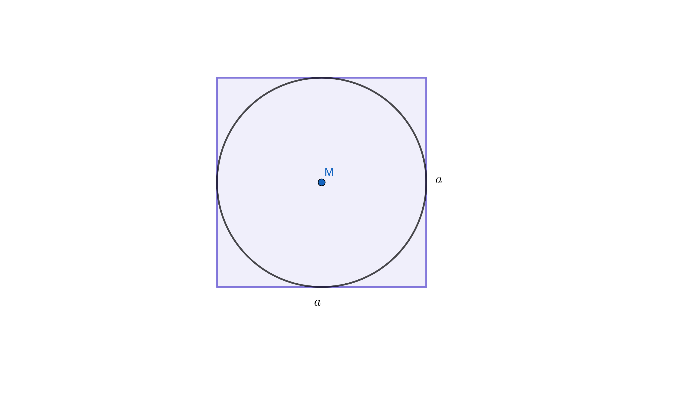

```{r setup, include = FALSE}
knitr::opts_chunk$set(echo = TRUE)
library("webex")
library("kableExtra")
library("plotrix")
```

```{css, echo=FALSE}
.box {
        display: flex;
      }

      .box > * {
        flex: 1 1 0;
      }
```

<!-- https://quizdidaktik.de/alles2dataurl/index.html  hier .ggb umwandeln!-->

## Der Kreisfläche auf der Spur - ein Versuchsaufbau

Der folgende "mathematische Versuchsaufbau" soll dir helfen, die Formel für den Flächeninhalt des Kreises herzuleiten und zu verstehen. Probiere also aus, was passiert, wenn du an den gegebenen "Stellschrauben drehst" (also die Schieberegler bedienst).

<br><br>

<iframe scrolling="no" title="Der Kreisfläche auf der Spur - ein Versuchsaufbau" src="https://www.geogebra.org/material/iframe/id/qehtzcfv/width/1302/height/632/border/888888/sfsb/true/smb/false/stb/false/stbh/false/ai/false/asb/false/sri/false/rc/false/ld/false/sdz/false/ctl/false" width="1302px" height="632px" style="border:0px;"> </iframe>

<br><br><br>

Solltest du Schwierigkeiten bei der Beantwortung der beiden Fragen aus dem "Versuchsaufbau" haben, gibt es hier noch drei Tipps: 

<br><br>


:::::: {class="box"}

::: {}

`r hide("Tipp 1")`

Erhöht man die Anzahl der Kreisteile immer mehr, nähert sich die neu angeordnete Fläche einem Rechteck an. Was sind Länge und Breite dieses Rechtecks?

`r unhide()`

:::

::: {}

`r hide("Tipp 2")`

Die Breite des Rechtecks kann man im "Versuchsaufbau" ablesen. Sie entspricht dem Radius $r$ des Kreises. Die Länge des Rechteck muss der halbe Kreisumfang sein. Warum? 

`r unhide()`

:::

::: {}

`r hide("Tipp 3")`

Setze die gefundenen Größen:

  * Breite des Rechtecks: $r$ und
  * Länge des Rechtecks: ${1 \over 2} \cdot U = {1 \over 2} \pi \cdot 2r$

in die Formel zur Berechung des Flächeninhaltes eines Rechtecks ein und vereinfache diese.

`r unhide()`

:::
::::::

<br><br>

## Versuchsprotokoll

Zunächst zerteilt man den Kreis in gleich große (Kuchen-) Stücke. 

Diese ordnet man neu an: Man legt sie so nebeneinander, so dass sie eine annähernd parallelogrammförmige Fläche ergeben. Je größer die Anzahl der Kreisteile wird, desto mehr nähert sich die Fläche einem Rechteck an. Würde man den Kreis in unendlich viele Teile zerschneiden, ergäbe sich schließlich tatsächlich ein Rechteck.

Den Flächeninhalt dieses Rechtecks kann man nun mit der bekannten Formel $A=l \cdot b$ berechnen. 
Die Breite des Rechtecks entspricht dabei dem Radius $r$, seine Länge dem halben Kreisumfang ${1 \over 2} \cdot U= \pi \cdot r$.


## Ergebnis

Damit ergibt sich für die Kreisfläche folgende Formel zur Berechnung des Flächeninhaltes:

$$\begin{align} A &= Länge \cdot Breite\\
{}\\
A &= {1 \over 2} \cdot U \cdot r\\
{}\\
A & ={1 \over 2} \cdot \pi \cdot 2 \cdot r \cdot r\\
{}\\
A & = {1 \over 2} \cdot 2 \cdot \pi \cdot r²\\
{}\\
A &= \pi \cdot r²
\end{align}$$

Für den Flächeninhalt eines Kreises gilt also: $\quad A= \pi \cdot r²$

<br><br>


### Aufgaben{.tabset}

#### {}

<br><br><br><br>

Hier geht es zurück zur Übersichtsseite [**Kreis**](https://gdischinger.github.io/Mathe_8d/03FormelnErstellen/Kreis.html).


Hier geht es zurück zur [**Startseite**](https://gdischinger.github.io/Mathe_8d/03FormelnErstellen/FlächenberechnungErinnerung.html).


#### Aufgabe 1
Berechne die fehlenden Größen.
```{r, 'kable'}
```
<br> |a) |b) | c)
------|------|------|-----
Radius $r$ | | | 
Durchmesser $d$ | |  | $7,543m$
Umfang $U$ |  | $1,543km$ | 
Flächeninhalt $A$ | $13cm²$  |  |

`r hide("Lösung")`

**Die fehlenden Größen lauten:**
```{r, 'kable'}
```
<br> |a) |b) | c)
------|------|------|-----
Radius $r$ | $2,034 cm$ | $0,246 km$ | $3,772 m$
Durchmesser $d$ | $4,068 cm$ | $0,491 km$ | $7,543m$
Umfang $U$ | $12,78 cm$  | $1,543km$ | $23,70 m$
Flächeninhalt $A$ | $13cm²$  | $0,189 km²$ | $44,69 m²$


 **Rechnungen:**

:::: {class="box"}

::: {}
**a)**

**Radius**

$A = \pi \cdot r²$ nach $r$ auflösen:

$$\begin{align} A &= \pi \cdot r² \quad |:\pi \\
{}\\
{A \over \pi} &= r² \quad |\sqrt{\quad}\\
{}\\
\sqrt{A \over \pi} &= r
\end{align}$$

$A=13cm²$ einsetzen:

$$r = \sqrt{13 cm² \over \pi} \approx 2,034 cm$$

**Durchmesser**

$d=2 \cdot r \approx 2 \cdot 2,034 cm \approx 4,068 cm$

<br>

**Umfang**

$U = \pi \cdot d \approx \pi \cdot  4,068 cm \approx 106,81 cm$
:::

::: {}

:::

::: {}
**b)**

**Durchmesser**

Die Formel für den Flächeninhalt eines Kreises $U= \pi \cdot d$ beschreibt den Zusammenhang zwischen Durchmesser und Umfang des Kreises.

Auflösen ergibt:

$$ \begin{align} U &= \pi \cdot d \quad\quad |: \pi \\
{}\\
{U \over \pi} &= d 
\end{align}$$.

$U=1,543 km$ einsetzen:

$$d={1,543 km \over \pi} \approx 0,491 km$$

<br>

**Radius**

$d = 2 \cdot r$ nach $r$ auflösen:

$$\begin{align} d &=2 \cdot r \quad |:2\\
{}\\
{d \over 2} &= r
\end{align}$$

$0,491 km$ einsetzen:

$$r \approx {0,491 km \over 2} \approx 0,246$$

<br>

**Flächeninhalt**

$A = \pi \cdot r² \approx \pi \cdot (0,246 km)² \approx 0,189 km²$


:::

::: {}

:::

::: {}
**c)**

**Umfang**

$U = \pi \cdot d = \pi \cdot 7,543 m \approx 23,70 m$

<br>

**Radius**

$d = 2 \cdot r$ nach $r$ auflösen:

$$\begin{align} d &=2 \cdot r \quad |:2\\
{}\\
{d \over 2} &= r
\end{align}$$

$7,543 m$ einsetzen:

$$r = {7,543 m \over 2} \approx 3,772 m$$

**Flächeninhalt**

$A = \pi \cdot r² \approx \pi \cdot (3,772 m)² \approx 44,69 m²$

:::

::::


`r unhide()`


<br><br><br>

Hier geht es zurück zur Übersichtsseite [**Kreis**](https://gdischinger.github.io/Mathe_8d/03FormelnErstellen/Kreis.html).


Hier geht es zurück zur [**Startseite**](https://gdischinger.github.io/Mathe_8d/03FormelnErstellen/FlächenberechnungErinnerung.html).


#### Aufgabe 2
In einer Pizzeria gibt es Pizzen in zwei Größen. Die kleine Pizza hat einen Durchmesser von $25cm$. Die Fläche der großen Pizza ist doppelt so groß wie die der kleinen Pizza. Berechne den Durchmesser der großen Pizza.


<br><br><br>

Hier geht es zurück zur Übersichtsseite [**Kreis**](https://gdischinger.github.io/Mathe_8d/03FormelnErstellen/Kreis.html).


Hier geht es zurück zur [**Startseite**](https://gdischinger.github.io/Mathe_8d/03FormelnErstellen/FlächenberechnungErinnerung.html).


#### Aufgabe 3
Untersuche an Zahlenbeispielen und begründe dann allgemein.

a) Wie verändert sich der Umfang bzw. der Flächeninhalt eines Kreises, wenn sich der Radius verdoppelt?

b) Wie verändert sich der Umfang bzw. der Flächeninhalt eines Kreises, wenn man den Radius um $10cm$ vergrößert?


<br><br><br>

Hier geht es zurück zur Übersichtsseite [**Kreis**](https://gdischinger.github.io/Mathe_8d/03FormelnErstellen/Kreis.html).


Hier geht es zurück zur [**Startseite**](https://gdischinger.github.io/Mathe_8d/03FormelnErstellen/FlächenberechnungErinnerung.html).


#### Aufgabe 4

:::: {class="box"}
::: {}

<br><br>
Ein kreisrunder Froschteich hat den Radius $r_1=7m$.

a) Um den Teich wird ein 3m breiter Weg angelegt. Welchen Flächeninhalt hat der Weg.

b) Wie breit ist der Weg, wenn er einen Flächeninhalt von $130 m²$ hat?

:::

::: {}


:::

::::


<br><br><br>

Hier geht es zurück zur Übersichtsseite [**Kreis**](https://gdischinger.github.io/Mathe_8d/03FormelnErstellen/Kreis.html).


Hier geht es zurück zur [**Startseite**](https://gdischinger.github.io/Mathe_8d/03FormelnErstellen/FlächenberechnungErinnerung.html).


#### Aufgabe 5

:::: {class="box"}
::: {}

<br><br>
Aus einer quadratischen Platte mit der Seitenlänge $a$ wird eine Kreisscheibe herausgeschnitten (vgl. Skizze).

a) Berechne den Verschnitt, wenn die Seite $a$ 4m lang ist.

b) Stelle eine Formel auf, mit der man den Flächeninhalt des Verschnitts in Abhängigkeit von $a$ bestimmen kann.

c) Wie viel Prozent der Gesamtfläche sind Verschnitt?

:::

::: {}



:::

::::

<br><br><br>

Hier geht es zurück zur Übersichtsseite [**Kreis**](https://gdischinger.github.io/Mathe_8d/03FormelnErstellen/Kreis.html).


Hier geht es zurück zur [**Startseite**](https://gdischinger.github.io/Mathe_8d/03FormelnErstellen/FlächenberechnungErinnerung.html).
