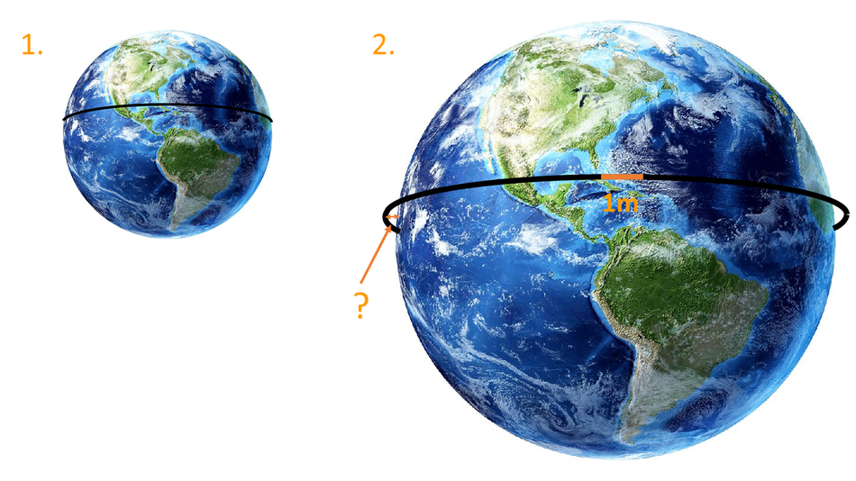
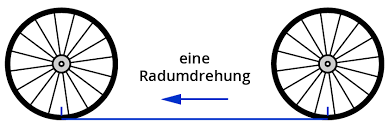

```{r setup, include = FALSE}
knitr::opts_chunk$set(echo = TRUE)
library("webex")
library("kableExtra")
```

```{css, echo=FALSE}
.box {
        display: flex;
      }

      .box > * {
        flex: 1 1 0;
      }
```


## Kreisuntersuchungen - ein Versuch

>  Du brauchst:
>
>  + ein Maßband oder eine Stück Schnur und ein Lineal
>  + ein Blatt Papier und
>  + einen Bleistift.
    
1. Geh bitte los und suche verschieden große Gegenstände, die kreisförmig sind bzw. mindestens eine kreisförmige Fläche haben.

2. Miss jeweils Umfang und Durchmesser des Kreises und stelle deine Ergebnisse tabellarisch dar.

`r hide("Eure Messergebnisse")`

```{r, echo=FALSE}
  
pi_data <- data.frame(
  "Gegenstand"  = c("Kerze", "Nachttischlampe", "Basketball", "Spardose", "Pringelspackung", "Nachttisch", "Wasserflasche", "Becher", "Nutelladeckel", "Lampenschirm", "Kerze", "Glas", "Pflanzentopf", "Fussball", "Flasche", "Füller", "Handcreme", "Kleber", "Müslischüssel", "Tasse", "Schüssel", "Spitzer", "Dose", "Kleber", "Kleber 2.0", "Kordel", "Stiftehalter", "Flasche", "Flaschendeckel", "Tasse", "Blumentopf", "Blumentopf 2.0", "Deckel", "Münze", "Lampenboden", "Flaschendeckel", "Marmeladenglas", "Flaschendeckel", "Tasse", "Trinkflasche", "Glas", "Eierbecher", "Kölschglas", "Deckel", "Kleber", "Spitzer", "Klebeband", "Tasse", "kleiner Topf", "mittlerer Topf", "großer Topf", "Tasse", "Ölflasche", "Schälchen", "Anspitzer", "Klebeband", "großer Topf", "Griechischer Joghurt", "Wasserglas", "Tasse", "Schüssel", "Spitzer", "Licht", "An-Knopf",  "Uhr", "Spitzer", "Lampe", "Flasche", "Tasse", "Packung", "Kaffe to go", "Lavalam. Deckel", "Pfanne", "Glas", "Tasse", "Dose", "Deckel", "Topf", "Glas", "Pfanne", "kleiner Topf", "kleine Pfanne", "Tasse", "Becher", "großer Topf", "Duftkerze", "Kakteentopf", "Trinkflaschenunterseite", "Nachttischlampe", "Stiftehalter", "Spiegel", "Müslischale", "Tesafilmrolle", "Kopf 15 jährige Schwester", "Flasche", "Kleber 1", "Flasche", "Kleber 2", "Tasse", "Kordel", "Stiftehalter", "Flaschendeckel", "Blumentopf 1", "Blumentopf 2"),
  
  "Durchmesser" = c(5.5, 12.0, 25.0, 10, 7.5, 40, 8, 8, 8, 19, 7.6, 8, 10, 21, 8.1, 1.5, 3.8, 3.1, 13, 6, 13, 3.5, 10, 3, 2, 4, 8.5, 7, 3, 9, 16, 17.5, 6.2, 1.8, 15, 3, 8.5, 5, 5, 6.5, 8.5, 6.5, 5, 3, 2.5, 3.7, 3.3, 9, 18.5, 22.5, 26.5, 8.5, 8, 11, 4, 9.5, 22, 10, 8, 7, 13, 3.5, 4, 2, 4, 3.5, 13, 4.5, 8.8, 4.5, 7.2, 3.9, 16, 7.5, 4.5, 7, 5, 21.5, 8, 29.5, 15, 26, 9.5, 10, 25.5, 7.1, 6.1, 6.3, 3.2, 8.5, 17, 12, 4, 30, 9, 3, 7, 2, 9, 4, 8.5, 3, 17.5, 16),
  
  "Umfang" = c(18, 38, 75, 35, 24.5, 125, 28.5, 25.5, 27, 60, 24, 26, 33, 66, 28, 15, 12, 10, 41, 21, 38, 14, 31.5, 10, 6.5, 13, 26, 23, 9.5, 20, 53.5, 49, 16, 5.5, 42, 10, 28, 15, 31, 21, 27.5, 21, 17, 9.4, 8.5, 12.8, 11.5, 26.2, 59, 78, 84, 27, 23, 33, 15, 30, 64, 24, 26, 22, 38, 14, 13.5, 7.0, 13.5, 13.0, 41.0, 17, 29, 16, 24.5, 12, 45, 26, 30, 34, 16, 67.5, 25.5, 89, 48, 76, 29.5, 35, 76, 23.3, 21, 22, 10.3, 26.5, 47, 35, 11, 53, 25, 10, 23.5, 6.5, 20, 13, 26, 9.5, 49, 53.5)
  )


pi_data <- pi_data %>% dplyr::mutate("U/D"= Umfang/Durchmesser)


pi_data_small <- pi_data[-c(94, 16, 39, 75, 76, 22, 62, 66, 68, 55, 46, 47),]


pi_data %>%
  kbl(col.names = c("Gegenstand", "Durchmesser (cm)", "Umfang (cm)", "Umfang/Durchmesser")) %>%
  kable_styling()
```
`r unhide()`
 
 <br>

```{r, echo=FALSE}
# 
# pi_data_sum <- pi_data%>% 
#   dplyr::summarise("Mittelwert Durchmesser" = mean(Durchmesser),
#                    "Mittelwert Umfang"      = mean(Umfang),
#                    "Mittelwert Umfang/Durchmesser" = mean(`U/D`))


pi_data_sum <- pi_data_small %>%
  dplyr::summarise("Mittelwert Durchmesser" = mean(Durchmesser),
                   "Mittelwert Umfang"      = mean(Umfang),
                   "Mittelwert Umfang/Durchmesser" = mean(`U/D`))


pi_data_sum %>%
  kbl(col.names = c("Mittelwert Durchmesser (cm)", "Mittelwert Umfang (cm)", "Mittelwert Umfang/Durchmesser")) %>%
  kable_styling()
```


<br>

3. Stelle deine Messergebnisse in einem Diagramm dar.

```{r, echo=FALSE}

library("scales")

x_vec <- pi_data$Durchmesser
y_vec <- pi_data$Umfang

#x2_vec <- pi_data$Durchmesser
#y2_vec <- pi_data$Umfang

x2_vec <- pi_data_small$Durchmesser
y2_vec <- pi_data_small$Umfang

par(mfrow=c(1,2))
plot(x=x_vec, y=y_vec, axes=FALSE, xlab="Durchmesser (cm)", ylab="Umfang (cm)", 
     pch=21, cex=.5, col=alpha("red", 0.5), bg=alpha("red", 0.5))
axis(1); axis(2); box()
text(x=30, y=53, labels="(D = 30 cm, U = 53 cm) \n Kopf der 15 jährigen Schwester", cex = 0.5, pos=1)
text(x=31, y=92.5, labels="(D= 29.5 cm, U = 89 cm) \n Pfanne", cex = 0.5, pos=2)
##
plot(x=x2_vec, y=y2_vec, axes=FALSE, xlab="Durchmesser (cm)", ylab="Umfang (cm)", 
     pch=21, cex=.5, col=alpha("red", 0.5), bg=alpha("red", 0.5))
axis(1); axis(2); box()
lm_obj <- lm(y2_vec ~ x2_vec)
abline(coef = coef(lm_obj))
#text(x=0, y=85, labels=expression(y=="2,8"~x+3), pos=4)
#text(x=x_vec, y=y_vec, labels(x_vec,y_vec), cex=0.7, pos = 3)
text(x=31, y=92.5, labels="(D= 29.5 cm, U = 89 cm) \n Pfanne", cex = 0.5, pos=2)
par(mfrow=c(2,1))
```

## Zusammenfassung unserer Ergebnisse

  + Unsere Datenpunkte lassen sich gut durch eine Gerade approximieren. Der Umfang eines Kreises wächst also proportional zu seinem Durchmesser. 
  + Der von uns empirisch ermittelte Proportionalitätsfaktor ist ungefähr 3,15
  + Das haben wir gut gemacht.


## Hätten wir keine Messfehler gemacht, dann ...

... hätten wir natürlich den wahren Proportionalitätsfaktor erhalten: $\pi$.

Es gilt nämlich: $${U \over d} = \pi$$
oder, wenn man die Gleichung nach $U$ auflöst:
$$U= \pi \cdot d = \pi \cdot 2 \cdot r$$
Der Durchmesser $d$ ist ja bekanntlich doppelt so lang wie der Radius $r$.

$\pi$ ist eine irrationale Zahl. Ganz exakt lässt sie sich also nicht fassen. Bei den meisten Rechnungen genügt es, als Näherungswert den Wert $\pi \approx 3,14$ zu verwenden. Euer Taschenrechner kennt $\pi$.


## Aufgaben{.tabset}

### {}

<br><br><br><br>

Hier geht es zurück zur Übersichtsseite [**Kreis**](https://gdischinger.github.io/Mathe_8d/03FormelnErstellen/Kreis.html).


Hier geht es zurück zur [**Startseite**](https://gdischinger.github.io/Mathe_8d/03FormelnErstellen/FlächenberechnungErinnerung.html).


### Aufgabe 1
Berechne die fehlenden Größen.
```{r, 'kable'}
```
<br> |a) |b) | c)
------|------|------|-----
Radius $r$ | $17cm$ | | 
Durchmesser $d$ | |  | $9,1 mm$
Umfang $U$ |  | $3,2m$ | 


`r hide("Lösung")`

**Die fehlenden Größen lauten:**
```{r, 'kable'}
```
<br> |a) |b) | c)
------|------|------|-----
Radius $r$ | $17cm$ |$0,509m$ |$4,55mm$
Durchmesser $d$ | $34cm$| $1,019m$  | $9,1 mm$
Umfang $U$ |$106,81cm$  | $3,2m$ | $28,59mm$


 **Rechnungen:**

:::: {class="box"}

::: {}
**a)**

**Durchmesser**

$d=2 \cdot r = 2 \cdot 17 cm = 34 cm$

<br>

**Umfang**

$U = \pi \cdot d = \pi \cdot 34 cm \approx 106,81 cm$
:::

::: {}

:::

::: {}
**b)**

**Durchmesser**

Einsetzen führt zu folgender Gleichung:

$3,2m = \pi \cdot d \quad$

<br>

Auflösen ergibt:

$$ \begin{align} 3,2m &= \pi \cdot d \quad\quad |: \pi \\
{}\\
{3,2m \over \pi} &= d \\
{}\\
\Rightarrow d & \approx 1,019 m
\end{align}$$.

<br>

**Radius**

Einsetzen führt zu folgender Gleichung:

$$1,019 m =2 \cdot r$$

<br>

Auflösen ergibt:

$$ \begin{align} 1,019 m &=2 \cdot r \quad\quad |: 2 \\
{}\\
{1,019m \over 2} &= r \\
{}\\
\Rightarrow r & \approx 0,509 m
\end{align}$$.
:::

::: {}

:::

::: {}
**c)**

**Umfang**

$U = \pi \cdot 9,1mm \approx 28,59 mm$

<br>

**Radius**

Einsetzen führt zu folgender Gleichung:

$$9,1 mm =2 \cdot r$$

<br>

Auflösen ergibt:

$$ \begin{align} 9,1 mm &=2 \cdot r \quad\quad |: 2 \\
{}\\
{9,1mm \over 2} &= r \\
{}\\
\Rightarrow r & = 4,55mm
\end{align}$$.
:::

::::


`r unhide()`


<br><br><br>

Hier geht es zurück zur Übersichtsseite [**Kreis**](https://gdischinger.github.io/Mathe_8d/03FormelnErstellen/Kreis.html).


Hier geht es zurück zur [**Startseite**](https://gdischinger.github.io/Mathe_8d/03FormelnErstellen/FlächenberechnungErinnerung.html).


### Aufgabe 2
Walter Hudson, einer der umfangreichsten Männer der Welt, hatte einen Bauchumfang von ca. $2,80 m$. Passt er durch eine $80 cm$ breite Tür?


`r hide("Lösung")`

**Vorüberlegung**

Um zu wissen, ob Walter Hudson durch die Tür passt, müsste man seinen Durchmesser kennen.


**Gegeben**

1. Walter Hudons Bauchumfang mit $2,80m = 280cm$
2. die Angabe, dass die Tür $80 cm$ breit ist.

Für den Umfang eines Kreises gilt:

$$ U = \pi \cdot d$$.


**Einsetzen**

Setzt man den gegebenen Bauchumfang ein, ergibt sich folgende Gleichung:
$$ 280 cm = \pi \cdot d $$

**Auflösen**

Diese Gleichung muss man nach $d$ auflösen:
$$\begin{align} 280 cm &= \pi \cdot d \quad\quad | : \pi\\
{}\\
{280cm \over \pi } &= d\\
{}\\
\Rightarrow \quad d &\approx 89 cm \quad > 80 cm
\end{align}$$

**Antwort**

Leider passt Walter Hudson nicht durch die Tür.

`r unhide()`


<br><br><br>

Hier geht es zurück zur Übersichtsseite [**Kreis**](https://gdischinger.github.io/Mathe_8d/03FormelnErstellen/Kreis.html).


Hier geht es zurück zur [**Startseite**](https://gdischinger.github.io/Mathe_8d/03FormelnErstellen/FlächenberechnungErinnerung.html).


### Aufgabe 3


a) Der Äquator hat eine Länge von etwa 40000 km. Wie groß ist der Erdradius $r$?

b) Ein 40000 km langes Seil, das am Äquator straff um die Erde gespannt war, wird geringfügig um 1m verlängert und so gestrafft, dass der Abstand von der Erde überall gleich ist. Kannst du jetzt unter diesem Seil hindurchkriechen?


:::: {class="box"}

::: {}

`r hide("Lösung der Teilaufgabe a)")`
**Vorüberlegung**

Die Länge des Äquators entspricht dem Umfang der Erde.


**Gegeben**

Der Umfang der Erde: $40000km$

Für den Umfang eines Kreises gilt:

$$ U = \pi \cdot d$$.


**Einsetzen**

Setzt man den gegebenen Erdumfang ein, ergibt sich folgende Gleichung:
$$ 40000km = \pi \cdot d $$

**Auflösen**

Diese Gleichung muss man nach $d$ auflösen:
$$\begin{align} 40000km &= \pi \cdot d \quad\quad | : \pi\\
{}\\
{40000km \over \pi } &= d\\
{}\\
\Rightarrow \quad d &\approx 12732 km
\end{align}$$


Damit folgt für den Erdradius:

$$ r = {1 \over 2} \cdot d = {1 \over 2} \cdot 12732 km \approx 6366 km$$

`r unhide()`

:::

::: {}

`r hide("Lösung der Teilaufgabe b)")`

Für den Umfang eines Kreises gilt:

$$U = 2 \cdot \pi \cdot r $$


**Auflösen**

Auflösen dieser Gleichung nach $r$ ergibt:

$$ \begin{align} U &= 2 \cdot \pi \cdot r \quad\quad | :2 \pi \\
{}\\
{U \over 2 \cdot \pi} &= r
\end{align}$$


**Einsetzen**

Setzt man nun die gegebenen Größen ein, ergibt sich:

$$r = {4ooookm + 1m \over 2 \pi} = \underbrace{40000km \over 2\pi}_{Erdradius}+\underbrace{1m \over 2\pi}_{"Zugewinn"}$$

Zum besseren Vorstellen hier noch eine Skizze:


Das Seil steht also ${1 \over 2\pi}m \approx 0,16 cm$ von der Erde ab. 

Zumindest ich bin zu groß um darunter durch zu passen ....


`r unhide()`


:::

::::


<br><br><br>

Hier geht es zurück zur Übersichtsseite [**Kreis**](https://gdischinger.github.io/Mathe_8d/03FormelnErstellen/Kreis.html).


Hier geht es zurück zur [**Startseite**](https://gdischinger.github.io/Mathe_8d/03FormelnErstellen/FlächenberechnungErinnerung.html).


### Aufgabe 4
Die Räder eines Fahrrades haben einen Durchmesser von $71cm$. Wie viele Umdrehungen macht jedes Rad pro km?

`r hide("Tipp")`



Wenn sich das Rad einmal ganz dreht, bist du um den Radumfang weitergekommen. Wieviele Umdrehungen passen in einen Kilometer?

`r unhide()`


`r hide("Lösung")`

Bei einem Durchmesser von $71cm$ hat das Rad einen Umfang von

$$U = d \cdot \pi =  71 cm \cdot \pi \approx 223cm = 2,23m$$
In einen Kilometer ($1000m$) passen also

$${1000 m \over 2,23 m} \approx 448,43$$

Radumdrehungen.

`r unhide()`


<br><br><br>

Hier geht es zurück zur Übersichtsseite [**Kreis**](https://gdischinger.github.io/Mathe_8d/03FormelnErstellen/Kreis.html).


Hier geht es zurück zur [**Startseite**](https://gdischinger.github.io/Mathe_8d/03FormelnErstellen/FlächenberechnungErinnerung.html).
